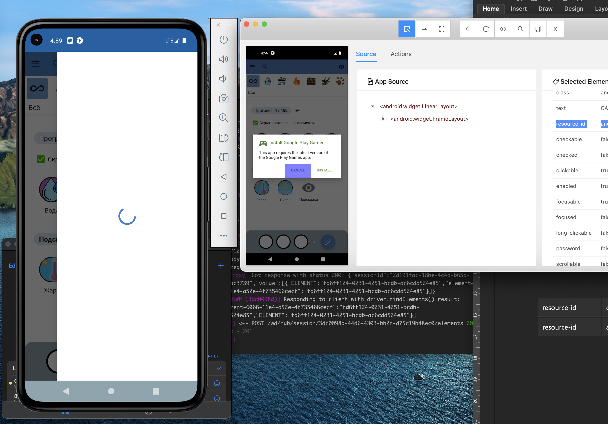
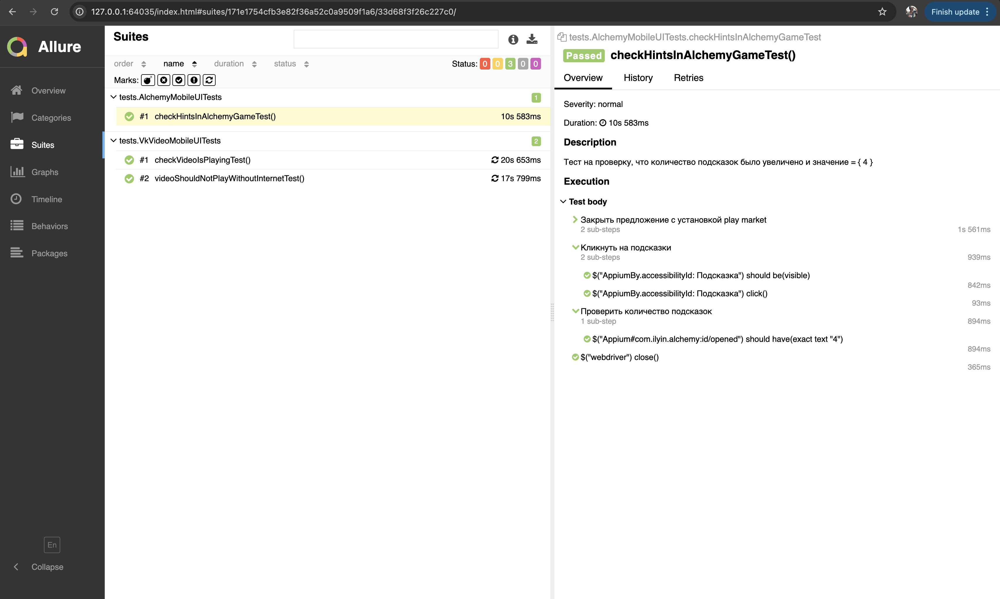
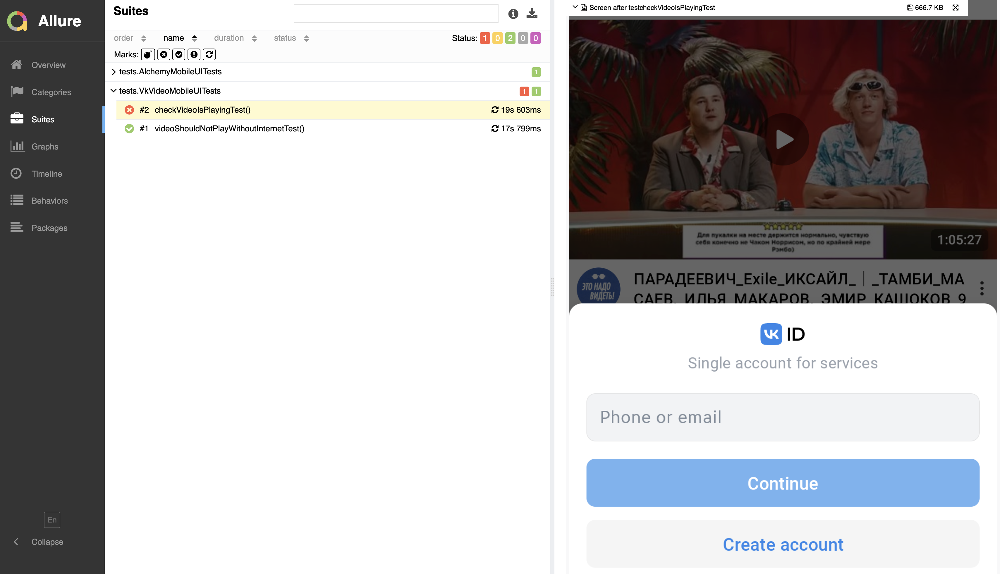
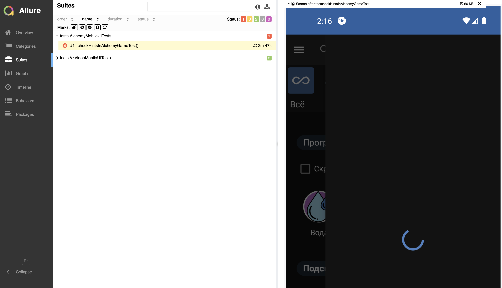

# Mobile Automation Framework (Appium + Selenide)

Стек: Appium V 1.18, Java 22, Selenide, Android Studio (Android 11 / api 30), Maven.

1. Написать автотест на приложение VK Видео (com.vk.vkvideo) . Необходимо проверить, что видео (на ваш выбор) - воспроизводится. Для завершения автотеста, должны быть обработаны, как положительные - видео воспроизводится, так и негативные - видео не воспроизводится.
https://play.google.com/store/apps/details?id=com.vk.vkvideo

2.  Написать автотест на мобильное приложение: Алхимия:Головоломка "com.ilyin.alchemy".
https://play.google.com/store/apps/details?id=com.ilyin.alchemy 

Шаги прохождения теста: 
1. Нажать на кнопку "Играть" в главном меню.  
2. Нажать на добавление подсказок.  
3. Получить подсказку за просмотр рекламы.  
4. Тест завершается после проверки на то что количество подсказок было увеличено и значение равно 4. 

Если кликнуть на кнопку "Подскази" приложение зависает (см. скрин ниже)

## Allure Result 

## Тезисно о проекте

Я немного увлекся и получился практически целый фреймворк, который потокобезопасный и масштабируемый.

AppContext разруливает работу с потоками. Дополнительно добавлена кастомная настройка от JUnit, которая лежит в ресурсах, и мы можем из коробки регулировать количество потоков.

Мне нравится подход к декларативному написанию автотестов, и здесь как раз в одном проекте используются два приложения. Очень удобно управлять всем через аннотации.  
В нашем случае это MobileApp, где мы передаем, какое приложение нужно использовать для конкретного теста.

Также добавлена логика, чтобы после завершения теста:
- закрывать driver, чтобы не расходовать ресурсы
- делать screenshot, если тест упал
- включать интернет, если он был отключен в негативном тесте (об этом ниже)

---

## Выполнение задания

Полностью выполнено **задание 1**.

Если говорить в контексте негативного теста, то тут есть несколько вариантов реализации.

Можно запустить тест с включенным VPN (я пробовал на протоколе VLESS) — в этом случае vkvideo работать не будет.

Но в текущем варианте было выбрано отключение Wi-Fi и cellular через ADB, так как из коробки не работает режим AirplaneMode на версиях Android > 10 (проверял).

---

## Частично выполнено задание 2

Почему частично: версия APK, которую я использовал, зависает при нажатии на кнопку подсказки (см. скрин в проекте в Git).

Версию скачивал из ApkMirror, возможно проблема в том, что попалась версия с багом.

---

## Возможные улучшения

Дополнительно можно реализовать APK helper, который будет автоматически доставать appActivity и appPackage.

---

## Масштабируемость проекта

Получился достаточно большой проект, но его можно легко масштабировать.

Если появятся новые приложения, достаточно:
- добавить название приложения в Enum
- добавить конфиги
- передавать приложение в аннотацию @MobileApp

---

## Подходы к работе с APK

В проекте реализованы два подхода (экспериментировал).

### 1. APK хранится в ресурсах

APK хранится в ресурсах проекта, устанавливается на эмулятор и передается через setApp.

Этот вариант показался самым удобным.

При таком подходе setAppActivity не требуется, так как Appium сам определяет необходимые параметры.

---

### 2. APK уже установлен на устройстве

В этом случае мы не используем setApp, а передаем setAppActivity и setAppPackage.

Этот вариант менее удобный, но в таком случае эти параметры обязательны.

---

## Allure отчеты

В Git также приложены Allure отчеты.

Один тест специально сделан с ошибкой, чтобы проверить работу функционала Screenshot при падении автотеста.

---

Было интересно вспомнить и узнать что-то новое.

Спасибо 🙂